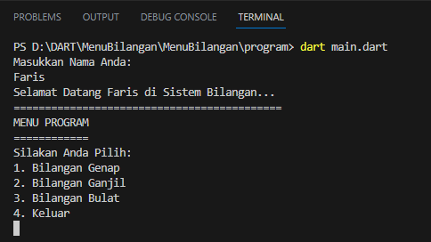

</p>

## Program Menu Bilangan ganjil, Bilangan Genap dan Bilangan Bulat</p>

Disini saya membuat programnya di Aplikasi Visual Studio Code (VS Code) </p></br>

# 1. Source Code Program: </p></br>
``` dart

import 'dart:io';

void main() {

  print('Masukkan Nama Anda:');
  String nama = stdin.readLineSync()!;

  print('Selamat Datang $nama di Sistem Bilangan... ');
  print('===========================================');
  bool selesai = false;

  while (!selesai) {
    print('MENU PROGRAM');
    print('============');
    print('Silakan Anda Pilih:');
    print('1. Bilangan Genap');
    print('2. Bilangan Ganjil');
    print('3. Bilangan Bulat');
    print('4. Keluar');

    String input = stdin.readLineSync()!;
    int opsi = int.parse(input);

    switch (opsi) {
      case 1:
        cekBilanganGenap();
        break;
      case 2:
        cekBilanganGanjil();
        break;
      case 3:
        cekBilanganBulat();
        break;
      case 4:
        selesai = true;
        print('Terima kasih Telah Memakai Aplikasi Ini');
        print('Devoloper Faris Syahluthfi');
        break;
      default:
        print('Opsi tidak valid. Silakan pilih opsi yang benar.');
        break;
    }
    print('\n');
  }
}

void cekBilanganGenap() {
  print('Masukkan sebuah angka:');
  int angka = int.parse(stdin.readLineSync()!);

  if (angka % 2 == 0) {
    print('$angka adalah bilangan genap.');
  } else {
    print('$angka bukan bilangan genap.');
  }
}

void cekBilanganGanjil() {
  print('Masukkan sebuah angka:');
  int angka = int.parse(stdin.readLineSync()!);

  if (angka % 2 != 0) {
    print('$angka adalah bilangan ganjil.');
  } else {
    print('$angka bukan bilangan ganjil.');
  }
}

void cekBilanganBulat() {
  print('Masukkan sebuah angka:');
  String input = stdin.readLineSync()!;
  double angka = double.parse(input);

  if (angka % 1 == 0) {
    print('$angka adalah bilangan bulat.');
  } else {
    print('$angka bukan bilangan bulat.');
  }
}


```
</p></br>

# 2. Penjelasan Code Programnya: </p></br>

Program Dart di atas adalah program sederhana yang memungkinkan pengguna memilih opsi untuk memeriksa apakah suatu bilangan merupakan bilangan genap, ganjil, atau bilangan bulat. Mari kita bahas secara rinci:

1. Import 'dart:io':
   Baris pertama program ini mengimpor pustaka `dart:io`, yang memberikan akses ke objek `stdin` untuk membaca input dari pengguna melalui konsol.

2. Fungsi `main()`:
   Fungsi `main()` merupakan titik masuk utama program. Pertama, program akan meminta pengguna memasukkan nama dan menyimpannya dalam variabel `nama`. Kemudian, program akan mencetak pesan selamat datang dengan menggunakan nilai `nama` yang dimasukkan pengguna.

3. Inisialisasi variabel dan loop:
   Variabel `selesai` digunakan untuk menentukan apakah program harus berhenti atau melanjutkan loop. Awalnya, variabel ini diatur sebagai `false`. Program akan terus meminta input dan mengeksekusi opsi hingga `selesai` bernilai `true`.

4. Menu Program:
   Program mencetak menu opsi yang tersedia menggunakan pernyataan `print()`.

5. Input dan switch statement:
   Program meminta pengguna memasukkan pilihan mereka dengan menggunakan `stdin.readLineSync()` dan menyimpannya dalam variabel `input`. Nilai `input` kemudian diubah menjadi bilangan bulat dengan `int.parse()` dan disimpan dalam variabel `opsi`. Program menggunakan pernyataan `switch` untuk mengevaluasi nilai `opsi` dan mengeksekusi fungsi yang sesuai tergantung pada pilihan yang dibuat pengguna.

6. Fungsi-fungsi pengecekan bilangan:
   Terdapat tiga fungsi, yaitu `cekBilanganGenap()`, `cekBilanganGanjil()`, dan `cekBilanganBulat()`. Setiap fungsi ini meminta pengguna memasukkan angka dan kemudian melakukan pengecekan sesuai dengan nama fungsinya. Hasil pengecekan kemudian dicetak ke layar.

7. Pernyataan default:
   Jika pengguna memasukkan opsi yang tidak valid, program akan mencetak pesan yang sesuai dengan pernyataan `default` dalam pernyataan `switch`.

Pada saat program dijalankan, pengguna akan diminta memasukkan nama mereka dan memilih opsi yang tersedia. Setelah memilih opsi, program akan mengeksekusi fungsi yang sesuai untuk memeriksa bilangan genap, ganjil, atau bilangan bulat sesuai dengan input yang diberikan. Program akan terus berjalan hingga pengguna memilih untuk keluar dengan memilih opsi "4".
</p></br>

# 3. Output Programnya: </p></br>
Cara menjalankan programnya yaitu di Terminal. Di aplikasi Visual Studio Code (VS Code) diatas ada beberapa menu, Pilih menu <b>Terminal</b> setelah itu <b>New Terminal</b> masukan code berikut ini: <b>dart nama_filemu (dart main.dart)</b>. Maka outputnya akan seperti ini:</p></br>

</p></br>


